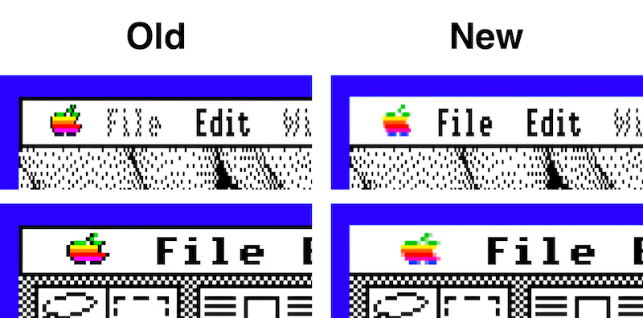

# Apple IIgs MenuManager (Tool015) Update

by Chris Parana

This version of the MenuManger features an updated Apple logo, logo colors, and menu presentation.

*Note! This version of the MenuManger should be treated as a beta release. To compile this yourself, you'll need to use MPW, and have the complete System 6.0.x source code.*

## Usage

Copy the Tool015 file to your `System/Tools` directory. This tool will load automatically on ROM01 machines. ROM3 machines feature a later version of the MenuManager and this will not automatically patch in.

## What's New

**InitPalette**

This routine has been updated to load the colors for the newer, better Apple logo. We have twice the colors now and need to load for both 320 and 640 mode accordingly.

**New and Updated Data Tables**

The tables for the logo data and mask for both 640 and 320 mode Apple logos have been updated.

Two new color tables to replace the original single table: `logocolora` and `logocolorb`. These contain the primary and secondary colors for the new logo, which are required as it is anti-aliased.

**New DrawRect**

This routine has been updated to draw a single bottom line on menu bars, instead of outlining the entire thing.

## What's Next

An init will need to be created to patch this in on ROM3 machines. ROM01 machines will automatically use this version of the tool if located into the System/Tools folder.